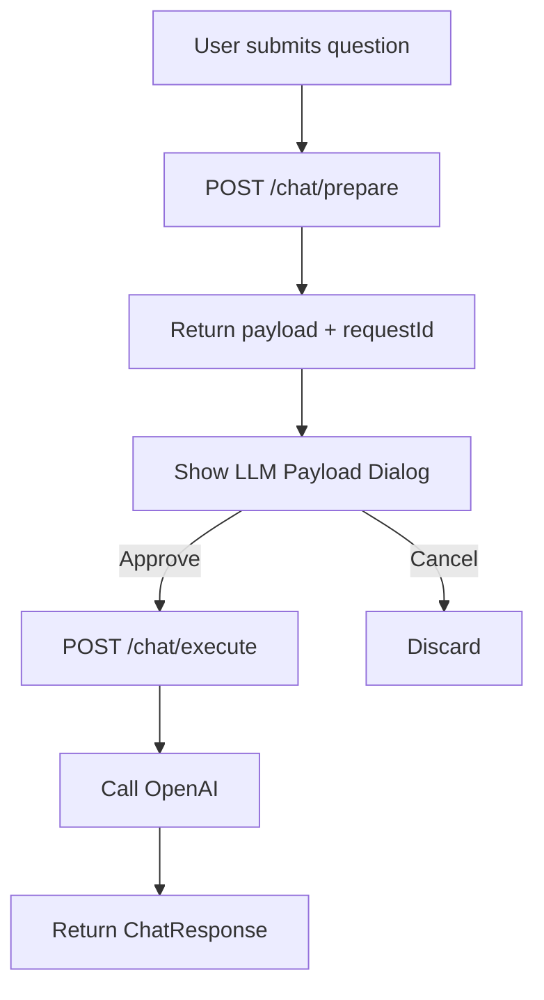

# Chat Prepare/Execute Flow (Dev Mode)

Reference for the two-phase chat flow used when Developer Mode is enabled. Allows developers to inspect the full LLM payload before it is sent.

## Purpose

- Inspect system prompt, user prompt, document chunks, legal chunks, and model params before the LLM is called
- Verify RAG context and retrieval quality during development
- Only active when both Developer Mode (frontend) and `CHAT_PREPARE_ENABLED` (backend) are enabled

## When Active

1. **Frontend**: Developer Mode enabled in Settings → Account → Developer Mode toggle
2. **Backend**: `CHAT_PREPARE_ENABLED` is not `'false'` (default: enabled)

## Flow



## Endpoints

| Endpoint | Method | Description |
|----------|--------|-------------|
| `/workspaces/:workspaceId/documents/:documentId/chat/prepare` | POST | Prepare RAG payload without calling LLM. Returns `{ requestId, payload }`. |
| `/workspaces/:workspaceId/documents/:documentId/chat/execute` | POST | Execute with `{ requestId }`. Calls LLM, returns `ChatResponse`. |

### Prepare Request

Same body as main chat:

```json
{
  "question": "string",
  "language": "en",
  "forceFresh": false
}
```

### Prepare Response

```json
{
  "requestId": "uuid",
  "payload": {
    "systemPrompt": "string",
    "userPrompt": "string",
    "documentChunks": [
      { "text": "string", "pageNumber": 1, "paragraphId": "p1", "similarity": 0.85 }
    ],
    "legalChunks": [
      { "text": "string", "sourceName": "string", "section": "string", "url": "string", "similarity": 0.8 }
    ],
    "question": "string",
    "model": "gpt-4o-mini",
    "temperature": 0.3,
    "maxTokens": 2000
  }
}
```

### Execute Request

```json
{
  "requestId": "uuid-from-prepare"
}
```

## Redis Cache

| Key Pattern | TTL | Purpose |
|-------------|-----|---------|
| `rag:prepare:{workspaceId}:{documentId}:{requestId}` | 5 min | Store prepared payload. Deleted after execute (one-time use). |

## Security

- **Scope**: Cache keys include `workspaceId` and `documentId`. Execute validates that the request is for the same workspace/document.
- **One-time use**: Payload is deleted from cache after successful execute (prevents replay).
- **Guards**: Same as main chat (JwtAuthGuard, WorkspaceGuard, RolesGuard).

## Configuration

| Variable | Default | Description |
|----------|---------|-------------|
| `CHAT_PREPARE_ENABLED` | `true` | Set to `false` to disable prepare/execute endpoints (returns 404). Use in production to hide the feature. |
| `LLM_MAX_TOKENS` | `2000` | Max output tokens for the LLM call (shared with the streaming chat path). Reflected as `maxTokens` in the prepare payload. |
| `OPENAI_CHAT_MODEL` / `ANTHROPIC_CHAT_MODEL` | `gpt-4o-mini` / `claude-sonnet-4-20250514` | Chat model used by the resolved LLM provider. Reflected as `model` in the prepare payload. |

## Related

- [RAG Pipeline](./rag-pipeline.md) – Main chat flow
- [RAG Cache](./rag-cache.md) – Semantic query cache
