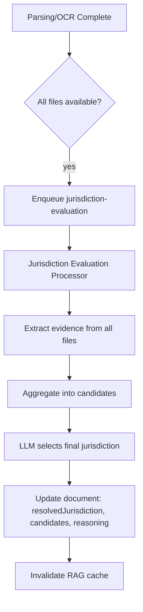

# Jurisdiction Resolution

Evidence-based jurisdiction resolution for ContractAI Review. Replaces the legacy "last file wins" logic with extraction, aggregation, LLM evaluation, and user override.

## Overview

When a document is processed, the system:

1. **Extracts** jurisdiction evidence from all available files (OCR/parsed text)
2. **Aggregates** evidence by frequency and confidence into candidates
3. **Evaluates** via LLM to choose the final jurisdiction (or falls back to rule-based)
4. **Stores** candidates so the user can override the AI choice
5. **Invalidates** RAG cache when jurisdiction changes

## Components

| Component | File | Role |
|-----------|------|------|
| Evidence extraction | `apps/api/src/rag/jurisdiction-resolver.service.ts` | `extractAllEvidence()` — regex patterns for governing law, choice of law, etc. |
| Evaluation | `apps/api/src/rag/jurisdiction-evaluation.service.ts` | `evaluateFromAllFiles()` — aggregates evidence, calls LLM, returns candidates |
| BullMQ processor | `apps/api/src/workers/jurisdiction-evaluation.processor.ts` | Processes `{ documentId, workspaceId }`, updates document, invalidates RAG cache |
| API | `apps/api/src/documents/documents.controller.ts` | PATCH `resolvedJurisdiction`, POST `re-evaluate-jurisdiction` |
| UI | `apps/web/src/app/documents/document-view/document-view.component.ts` | Jurisdiction dropdown (when >1 candidate), Re-evaluate button |

## Evidence Patterns

The resolver matches explicit and inferred patterns, including:

- "governed by and construed in accordance with the laws of"
- "choice of law"
- "proper law of"
- "laws of [country]"
- "jurisdiction of [country/court]"
- Country/region name mappings (Ireland→IE, England→GB, etc.)

## Flow

## Triggers

- **Automatic**: When parsing/OCR completes and the document becomes `AVAILABLE`, the parsing/OCR processor enqueues a jurisdiction-evaluation job.
- **Manual**: User can call `POST /workspaces/:id/documents/:docId/re-evaluate-jurisdiction` (rate-limited to 5/min).

## User Override

When `jurisdictionCandidates.length > 1`, the document view shows a dropdown. The user can:

- Select a different jurisdiction from the candidates
- Clear jurisdiction (select "None")

On change, the frontend calls `PATCH /documents/:id` with `resolvedJurisdiction`. The API:

- Updates the document
- Invalidates RAG cache
- Logs `JURISDICTION_OVERRIDE` audit event

## Data Model

- `Document.resolvedJurisdiction` — final jurisdiction (AI-chosen or user override)
- `Document.jurisdictionStatus` — `explicit` | `inferred` | `unknown`
- `Document.jurisdictionCandidates` — `JurisdictionCandidate[]` with evidence for override
- `Document.jurisdictionReasoning` — LLM reasoning (optional)

## RAG Cache Invalidation

Jurisdiction changes invalidate the RAG semantic cache for the document because:

- Legal RAG retrieval filters by `resolvedJurisdiction`
- Cached answers may have been generated with a different jurisdiction

Invalidation is triggered by:

- Jurisdiction evaluation processor (after updating document)
- Documents service (when user overrides via PATCH)

## Adding a New Jurisdiction (Phase 3 Checklist)

When you add support for a new jurisdiction (ISO 3166 alpha-2 code, e.g.
`DK`, `FI`, `IE`), do all of the following so the legal-grade pipeline
can ground answers and red-flags against real statutes:

1. **Statutes corpus** — Add YAML files under
   `services/legal-corpus/<JURIS>/<act-slug>.yaml`. Each file MUST
   declare `actName`, `actYear`, `jurisdiction`, `lastVerified` (ISO
   date), `url`, and an array of `sections[]` (each with
   `section`, `title`, `text`).
2. **Seed** — Run `pnpm tsx apps/api/src/scripts/seed-legal-corpus.ts`
   (or set `LEGAL_CORPUS_AUTO_SEED=on` in dev) so `LegalSource` and
   `Embedding` rows are created/updated. The script warns on entries
   whose `lastVerified` is older than 6 months.
3. **Terminology rules** — In
   `services/red-flag-rules/<version>/terminology.yaml`, add a rule
   block with `appliesTo: jurisdiction:<JURIS>` for any imported terms
   that are illegal/inappropriate in this jurisdiction (e.g. using UK
   "qualifying earnings" wording in an Irish contract).
4. **Missing-statute rules** — In
   `services/red-flag-rules/<version>/missing-statute.yaml`, declare
   the topic regex and the `requiredAnyPattern` set of statute names
   that MUST appear when the topic is discussed for this jurisdiction.
5. **Bump rules version** — If you changed any rule YAML, bump the
   directory under `services/red-flag-rules/` (e.g. `v1` → `v2`) and
   set `RED_FLAG_RULES_VERSION=v2` so persisted reviews regenerate
   under the new key.
6. **Sample contract** — Drop a representative DOCX into the test
   fixtures and extend the golden-answer integration test
   (`apps/api/src/rag/__tests__/golden-answer.spec.ts`) with at least
   one assertion against a known issue and one named-statute citation.
7. **i18n** — If the jurisdiction adds new categories or severity
   labels, mirror them across `apps/web/src/assets/i18n/{en,de,es,pt-BR}.json`
   under `legalAnswer.category` / `legalAnswer.severity`.
