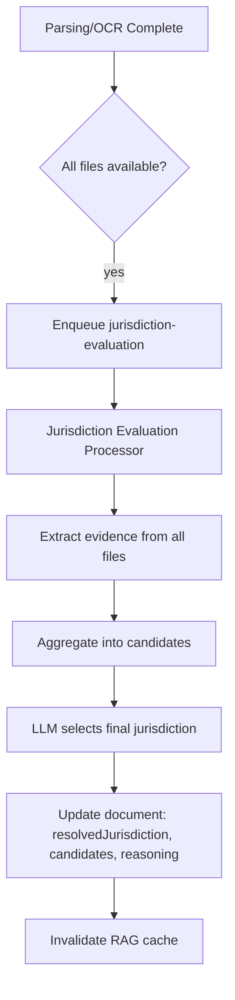

# Jurisdiction Resolution

Evidence-based jurisdiction resolution for ContractAI Review. Replaces the legacy "last file wins" logic with extraction, aggregation, LLM evaluation, and user override.

## Overview

When a document is processed, the system:

1. **Extracts** jurisdiction evidence from all available files (OCR/parsed text)
2. **Aggregates** evidence by frequency and confidence into candidates
3. **Evaluates** via LLM to choose the final jurisdiction (or falls back to rule-based)
4. **Stores** candidates so the user can override the AI choice
5. **Invalidates** RAG cache when jurisdiction changes

## Components

| Component | File | Role |
|-----------|------|------|
| Evidence extraction | `apps/api/src/rag/jurisdiction-resolver.service.ts` | `extractAllEvidence()` — regex patterns for governing law, choice of law, etc. |
| Evaluation | `apps/api/src/rag/jurisdiction-evaluation.service.ts` | `evaluateFromAllFiles()` — aggregates evidence, calls LLM, returns candidates |
| BullMQ processor | `apps/api/src/workers/jurisdiction-evaluation.processor.ts` | Processes `{ documentId, workspaceId }`, updates document, invalidates RAG cache |
| API | `apps/api/src/documents/documents.controller.ts` | PATCH `resolvedJurisdiction`, POST `re-evaluate-jurisdiction` |
| UI | `apps/web/src/app/documents/document-view/document-view.component.ts` | Jurisdiction dropdown (when >1 candidate), Re-evaluate button |

## Evidence Patterns

The resolver matches explicit and inferred patterns, including:

- "governed by and construed in accordance with the laws of"
- "choice of law"
- "proper law of"
- "laws of [country]"
- "jurisdiction of [country/court]"
- Country/region name mappings (Ireland→IE, England→GB, etc.)

## Flow

## Triggers

- **Automatic**: When parsing/OCR completes and the document becomes `AVAILABLE`, the parsing/OCR processor enqueues a jurisdiction-evaluation job.
- **Manual**: User can call `POST /workspaces/:id/documents/:docId/re-evaluate-jurisdiction` (rate-limited to 5/min).

## User Override

When `jurisdictionCandidates.length > 1`, the document view shows a dropdown. The user can:

- Select a different jurisdiction from the candidates
- Clear jurisdiction (select "None")

On change, the frontend calls `PATCH /documents/:id` with `resolvedJurisdiction`. The API:

- Updates the document
- Invalidates RAG cache
- Logs `JURISDICTION_OVERRIDE` audit event

## Data Model

- `Document.resolvedJurisdiction` — final jurisdiction (AI-chosen or user override)
- `Document.jurisdictionStatus` — `explicit` | `inferred` | `unknown`
- `Document.jurisdictionCandidates` — `JurisdictionCandidate[]` with evidence for override
- `Document.jurisdictionReasoning` — LLM reasoning (optional)

## RAG Cache Invalidation

Jurisdiction changes invalidate the RAG semantic cache for the document because:

- Legal RAG retrieval filters by `resolvedJurisdiction`
- Cached answers may have been generated with a different jurisdiction

Invalidation is triggered by:

- Jurisdiction evaluation processor (after updating document)
- Documents service (when user overrides via PATCH)
