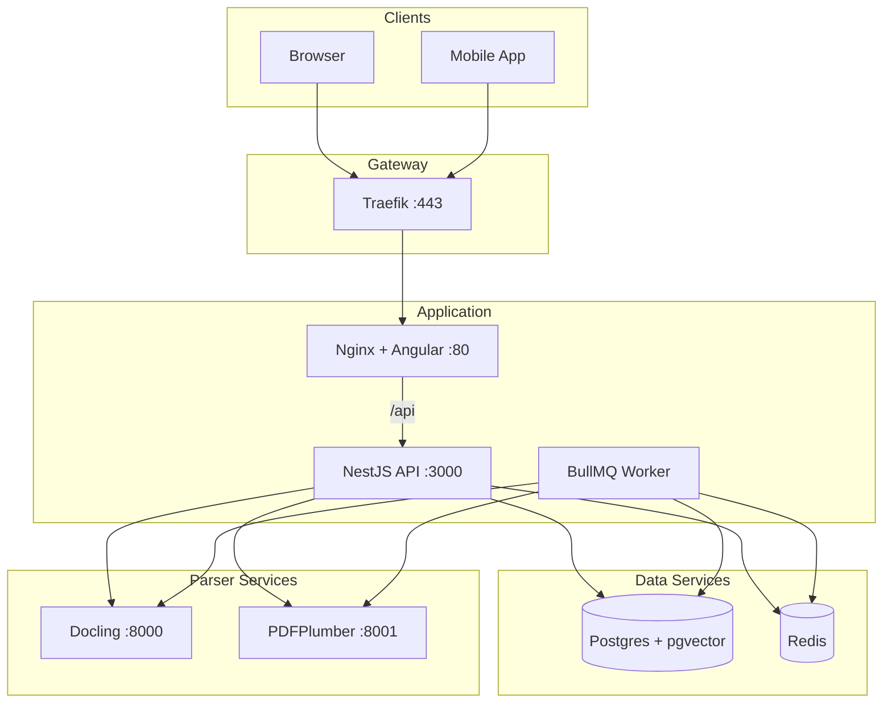

# ContractAI Review — Architecture Overview

High-level architecture of the ContractAI Review platform.

## Monorepo Layout

```
contractor-reviwer/
├── apps/
│   ├── api/          # NestJS (API REST + Workers BullMQ)
│   └── web/          # Angular SPA + Capacitor (web/iOS/Android)
├── packages/
│   └── shared/       # Types, enums, interfaces shared between api and web
├── services/
│   ├── docling/      # Python microservice (PDF, DOCX, images → markdown)
│   └── pdfplumber/   # Python microservice (PDF → markdown)
├── deploy/           # Production deployment (Traefik, docker-compose)
├── docker-compose.yml
└── pnpm-workspace.yaml
```

## Stack

| Layer | Technology |
|-------|------------|
| **Backend** | NestJS, TypeORM, PostgreSQL + pgvector |
| **Queue** | BullMQ + Redis |
| **Storage** | S3/R2 compatible (local in dev) |
| **Parsers** | Docling, PDFPlumber (Python), DPT-2, LlamaParse, Unstructured (cloud) |
| **Frontend** | Angular 21, PrimeNG, Tailwind, Capacitor |
| **AI** | OpenAI (embeddings, chat RAG) |

## Services Diagram



## Data Flow

### Upload Pipeline

```
Upload (user chooses parser or uses default)
  ↓
Validation (size, type, MIME sniffing)
  ↓
BullMQ: parsing → chunking → embeddings
  ↓
Document available for RAG
```

### Rate Limiting

- **Per user/workspace**: Requests per minute/hour/day, token budget per day (OpenAI)
- **Configuration**: `RATE_LIMIT_*` env vars (see [setup.md](../guides/setup.md))
- **Implementation**: `RateLimitGuard` (in-memory for MVP; Redis recommended for production)

### Chat / RAG Flow

```
User question
  ↓
Embed question (OpenAI text-embedding-3-small)
  ↓
Vector search (contract chunks + legal chunks)
  ↓
Build context with citations
  ↓
OpenAI chat (PromptService, workspace overrides)
  ↓
Response with confidence + citations
```

## User Guide

For end-user help and step-by-step instructions, see the topic-based user guide:

- [User Guide (docs/user-guide/README.md)](../user-guide/README.md) — How to use ContractAI Review (workspaces, documents, chat, redline, settings, privacy, audit, developer mode)

## Architecture Docs

- [deployment.md](deployment.md) — Production deployment with Traefik, TLS
- [rag-pipeline.md](rag-pipeline.md) — RAG pipeline reference (file map, flow, config)
- [vector-db-separation.md](vector-db-separation.md) — Future migration to separate vector DB
- [storage.md](storage.md) — S3/local storage, validations
- [workspace-rbac.md](workspace-rbac.md) — Multi-tenant, RBAC
- [document-parsers.md](document-parsers.md) — Parser reference
