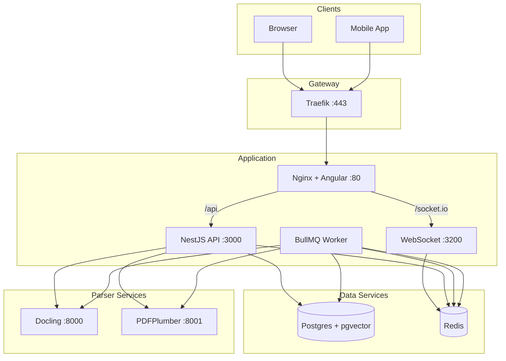

# ContractAI Review — Architecture Overview

High-level architecture of the ContractAI Review platform.

## Monorepo Layout

```
contractor-reviwer/
├── apps/
│   ├── api/          # NestJS (API REST + Workers BullMQ)
│   └── web/          # Angular SPA + Capacitor (web/iOS/Android)
├── packages/
│   └── shared/       # Types, enums, interfaces shared between api and web
├── services/
│   ├── docling/      # Python microservice (PDF, DOCX, images → markdown)
│   └── pdfplumber/   # Python microservice (PDF → markdown)
├── deploy/           # Production deployment (Traefik, docker-compose)
├── docker-compose.yml
└── pnpm-workspace.yaml
```

## Stack

| Layer | Technology |
|-------|------------|
| **Backend** | NestJS, TypeORM, PostgreSQL + pgvector |
| **Queue** | BullMQ + Redis |
| **Storage** | S3/R2 compatible (local in dev) |
| **Parsers** | Docling, PDFPlumber (Python), DPT-2, LlamaParse, Unstructured (cloud) |
| **Frontend** | Angular 21, PrimeNG, Tailwind, Capacitor |
| **AI (embeddings)** | OpenAI `text-embedding-3-small` |
| **AI (chat/redline LLM)** | Provider-agnostic via `LlmProviderRegistry`. Adapters: OpenAI (default), Anthropic. Selected per-workspace via `defaultLlmProvider` setting. |
| **WebSocket** | Socket.IO + Redis adapter + Redis Streams (job progress) |

## Services Diagram



## Data Flow

### Upload Pipeline

```
Upload (user chooses parser or uses default)
  ↓
Validation (size, type, MIME sniffing)
  ↓
BullMQ: parsing → chunking → embeddings
  ↓
Document available for RAG
```

### Rate Limiting

- **Per user/workspace**: Requests per minute/hour/day, token budget per day (OpenAI)
- **Configuration**: `RATE_LIMIT_*` env vars (see [setup.md](../guides/setup.md))
- **Implementation**: `RateLimitGuard` (in-memory for MVP; Redis recommended for production)

### Real-time: Document Job Progress

BullMQ workers (parsing, chunking, embeddings, jurisdiction-evaluation, summarize-memory) update `DocumentJob` in Postgres and publish to Redis Stream `job:progress`. The API consumes the stream and emits `job:progress` via WebSocket (port 3200) to clients subscribed to the document. Replaces aggressive REST polling. See [websocket.md](websocket.md).

> The previous standalone Tesseract OCR worker was removed; OCR is now performed inside the Docling parser microservice when needed.

### Chat / RAG Flow

Chat is **streaming-only** via Server-Sent Events (`POST /chat/stream`). The legacy non-streaming `POST /chat` endpoint and `RagService.generateAnswer*()` helpers were removed.

```
User question (POST /chat/stream)
  ↓
Embed question (OpenAI text-embedding-3-small)
  ↓
Semantic cache lookup (skip if forceFresh)
  ↓
Vector search (document chunks + legal chunks)
  ↓
Inject memory (document/thread conversation summaries)
  ↓
Build context with citations (DocumentCitation / LegalSourceCitation)
  ↓
LLM provider streaming completion (OpenAI or Anthropic, per workspace)
  ↓
SSE stream of `chunk` events → final `done` event { answerText, confidence, citations, fromCache }
  ↓
Persist message + SummarizeMemory job (async) → update thread memory
```

In Developer Mode, the two-step `POST /chat/prepare` → `POST /chat/execute` flow is also available; see [chat-prepare-dev-mode.md](chat-prepare-dev-mode.md).

## User Guide

For end-user help and step-by-step instructions, see the topic-based user guide:

- [User Guide (docs/user-guide/README.md)](../user-guide/README.md) — How to use ContractAI Review (workspaces, documents, chat, redline, settings, privacy, audit, developer mode)

## Architecture Docs

- [logging.md](logging.md) — Backend logging strategy, flow-tracking logs, LOG_LEVEL configuration
- [websocket.md](websocket.md) — WebSocket architecture, Redis Streams, job progress
- [deployment.md](deployment.md) — Production deployment with Traefik, TLS
- [rag-pipeline.md](rag-pipeline.md) — RAG pipeline reference (file map, flow, config)
- [rag-cache.md](rag-cache.md) — Semantic query cache (Redis), thresholds, invalidation
- [chat-prepare-dev-mode.md](chat-prepare-dev-mode.md) — Two-step prepare/execute chat (Developer Mode)
- [chat-markdown-rendering.md](chat-markdown-rendering.md) — Incremark-based Markdown rendering for chat answers
- [memory.md](memory.md) — Chat memory (thread/document summaries, SummarizeMemory job, RAG injection, purge, DSAR)
- [vector-db-separation.md](vector-db-separation.md) — Future migration to separate vector DB
- [storage.md](storage.md) — S3/local storage, validations
- [workspace-rbac.md](workspace-rbac.md) — Multi-tenant, RBAC
- [document-parsers.md](document-parsers.md) — Parser reference
- [jurisdiction-resolution.md](jurisdiction-resolution.md) — Governing-law extraction, evaluation, candidates
- [prompt-generator.md](prompt-generator.md) — LLM-assisted document/workspace prompt generation
