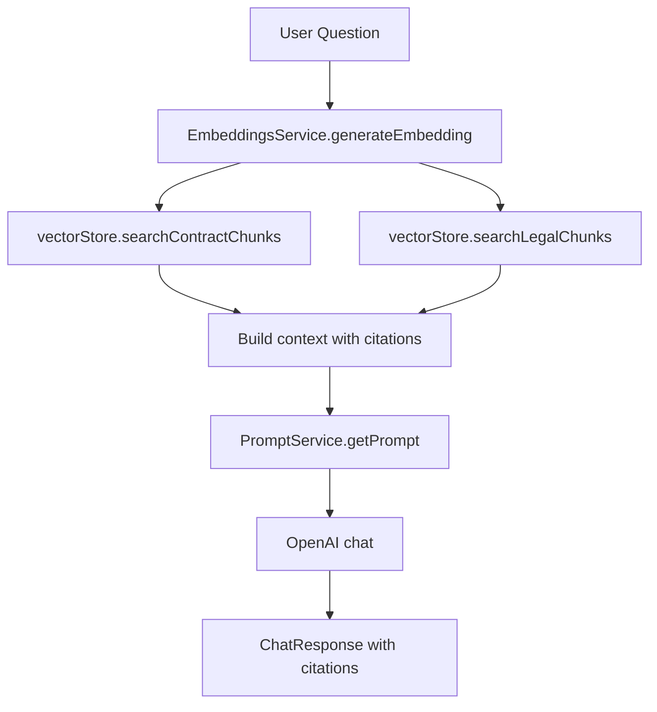

# RAG Pipeline Reference

Canonical reference for the ContractAI Review RAG pipeline. Use this document to understand file locations, data flow, types, and configuration.

## File Map

| Component | File | Role |
|-----------|------|------|
| Main RAG flow | `apps/api/src/rag/rag.service.ts` | `generateAnswer()`: embed question, search chunks, build context, call OpenAI |
| Contract retrieval | Same file | `searchContractChunks()` — pgvector cosine similarity |
| Legal retrieval | Same file | `searchLegalChunks()` — pgvector + jurisdiction filter |
| Embeddings | `apps/api/src/rag/embeddings.service.ts` | OpenAI `text-embedding-3-small` |
| Chunking | `apps/api/src/rag/chunking.service.ts` | Paragraph/sentence/fixed-size strategies |
| Prompts | `apps/api/src/prompts/prompt.service.ts` | DB-backed prompts, workspace overrides |
| Vector store | `apps/api/src/vector-store/` | `IVectorStore` interface, pgvector implementation |
| Ingestion | `apps/api/src/workers/parsing.processor.ts`, `chunking.processor.ts`, `embeddings.processor.ts` | Parsing → Chunking → Embeddings |
| Redline RAG | `apps/api/src/documents/redline.service.ts` | Similar flow for redline generation |
| Parsers | `apps/api/src/parsers/` | Docling, PDFPlumber, DPT-2 adapters |

## Data Flow

### Ingestion Flow


Parsing uses parser adapters (Docling default, PDFPlumber, DPT-2). Docling and PDFPlumber are Python microservices in `services/docling/` and `services/pdfplumber/`.

### Chat Flow



Flow: `ChatController` → `RagService.generateAnswer()` → `EmbeddingsService` + `IVectorStore` + `PromptService` → OpenAI.

### Redline Flow

Similar RAG flow in `redline.service.ts`: selected text + contract/legal context → `PromptService` (redline prompts + playbook) → OpenAI → structured JSON with suggestedText, explanation, citations.

## Key Types

### ChatResponse (from `@contractai-review/shared`)

```typescript
interface ChatResponse {
  answerText: string;
  confidence: 'high' | 'medium' | 'low';
  citations: Citation[];
  notFound: boolean;
}
```

### Citation (from `@contractai-review/shared`)

```typescript
interface Citation {
  type: 'contract' | 'legal';
  fileName?: string;
  pageNumber?: number;
  paragraph?: string;
  paragraphId?: string;
  quoteSnippet?: string;
  sourceName?: string;
  section?: string;
  url?: string;
}
```

### VectorStore (from `apps/api/src/vector-store/vector-store.interface.ts`)

```typescript
interface IVectorStore {
  searchContractChunks(queryEmbedding: number[], documentId: string, limit?: number): Promise<VectorSearchResult<Chunk>[]>;
  searchLegalChunks(queryEmbedding: number[], filters?: LegalChunkFilters, limit?: number): Promise<LegalChunkSearchResult[]>;
}

interface VectorSearchResult<T> {
  item: T;
  distance: number; // similarity (1 - cosine_distance)
}

interface LegalChunkSearchResult extends VectorSearchResult<Embedding> {
  sourceName?: string;
  section?: string;
  country?: string;
  jurisdiction?: string;
  url?: string;
}
```

## Configuration

### Environment Variables

| Variable | Description |
|----------|-------------|
| `OPENAI_API_KEY` | Required for RAG (embeddings + chat) |
| `OPENAI_CHAT_MODEL` | Chat model (default: `gpt-4o-mini`) |
| `DOCLING_URL` | Docling service URL (default: `http://localhost:8000`) |
| `PDFPLUMBER_URL` | PDFPlumber service URL (default: `http://localhost:8001`) |

### Workspace Settings (via Workspace Settings UI or API)

| Setting | Keys | Description |
|---------|------|-------------|
| `chunkingStrategy` | `paragraph`, `sentence`, `fixed_size` | How text is split for RAG |
| `defaultDocumentParser` | `docling`, `pdfplumber`, `dpt2`, `llamaparse`, `unstructured` | Parser used when none selected at upload |
| `parserApiKeys` | Per-parser encrypted keys | For DPT-2, LlamaParse, Unstructured |
| Prompt overrides | `chat.system`, `chat.user`, `redline.*` | Override prompts per workspace |

### Prompt Keys (from `packages/shared/src/constants/prompts.ts`)

- `chat.system`, `chat.user` — Chat RAG
- `redline.system`, `redline.user` — Redline
- `redline.playbook.balanced`, `redline.playbook.conservative`, `redline.playbook.client-friendly` — Playbook variations

## Current State Summary

| Area | Status |
|------|--------|
| RAG pipeline | `RagService` + workers — centralized, works |
| Prompts | `PromptService` — DB-backed, workspace overrides |
| Docling | **Default parser** — DoclingAdapter, `services/docling/` |
| DOCX | Supported — Docling, PDFPlumber, DPT-2 |
| Chunking | Paragraph/sentence/fixed-size configurable |
| Vector search | pgvector cosine similarity |

## Future Work

Recommendations for improvements:

1. **Policy answer** — Fallback chain: VectorDB error → keyword search; LLM error → formatted chunks; Embedding error → text search
2. **Cache** — Semantic query cache in Redis; key `(documentId, jurisdiction, query)`; TTL 24h; invalidate on document reprocess
3. **Hybrid recall** — Add keyword search (tsvector/pg_trgm); fuse with semantic via RRF or weighted score
4. **Monitoring** — Metrics for embedding latency, retrieval similarity, chunk count
5. **Local LLM** — Abstract `LLMProvider`; support vLLM, Llama.cpp via config

See the original gap analysis (archived) for detailed recommendations.
