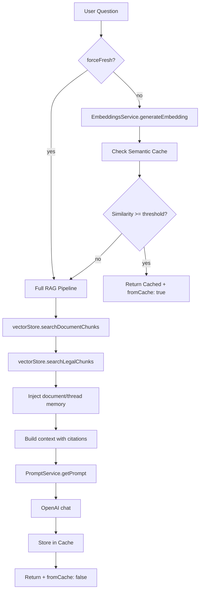

# RAG Pipeline Reference

Canonical reference for the ContractAI Review RAG pipeline. Use this document to understand file locations, data flow, types, and configuration.

## File Map

| Component | File | Role |
|-----------|------|------|
| Main RAG flow | `apps/api/src/rag/rag.service.ts` | `generateAnswerStream()`: embed question, search chunks, inject memory, build context, stream LLM completion (SSE) |
| Document retrieval | Same file | `searchDocumentChunks()` — pgvector cosine similarity |
| Legal retrieval | Same file | `searchLegalChunks()` — pgvector + jurisdiction filter |
| Jurisdiction resolution | `apps/api/src/rag/jurisdiction-resolver.service.ts`, `jurisdiction-evaluation.service.ts` | Evidence extraction, LLM evaluation, candidates for user override; see [jurisdiction-resolution.md](./jurisdiction-resolution.md) |
| Memory injection | Same file | `MemoryService.getDocumentAndThreadMemory()` — document/thread summaries prepended to context |
| Embeddings | `apps/api/src/rag/embeddings.service.ts` | OpenAI `text-embedding-3-small` |
| Chunking | `apps/api/src/rag/chunking.service.ts` | Paragraph/sentence/fixed-size strategies |
| Prompts | `apps/api/src/prompts/prompt.service.ts` | DB-backed prompts, workspace overrides |
| Prompt Generator | `apps/api/src/prompts/prompt-generator.service.ts` | LLM-assisted generation of document/workspace prompts from title+description; see [prompt-generator.md](./prompt-generator.md) |
| Vector store | `apps/api/src/vector-store/` | `IVectorStore` interface, pgvector implementation |
| Ingestion | `apps/api/src/workers/parsing.processor.ts`, `chunking.processor.ts`, `embeddings.processor.ts` | Parsing → Chunking → Embeddings |
| Memory summarization | `apps/api/src/workers/summarize-memory.processor.ts` | BullMQ job: summarize thread Q&A → upsert thread memory |
| Redline RAG | `apps/api/src/documents/redline.service.ts` | Similar flow for redline generation |
| Memory | `apps/api/src/memory/memory.service.ts` | Thread/document memory for RAG context injection |
| Memory entity | `apps/api/src/entities/memory.entity.ts` | `scopeType` (thread/document/workspace), `scopeId`, `content`, `version` |
| Parsers | `apps/api/src/parsers/` | Docling, PDFPlumber, DPT-2 adapters |

## Data Flow

### Ingestion Flow


Parsing uses parser adapters (Docling default, PDFPlumber, DPT-2). Docling and PDFPlumber are Python microservices in `services/docling/` and `services/pdfplumber/`.

### Chat Flow



Flow: `ChatController.chatStream()` (`POST /chat/stream`, SSE) → `RagService.generateAnswerStream()` → semantic cache lookup (or bypass if `forceFresh`) → `EmbeddingsService` + `IVectorStore` + `MemoryService.getDocumentAndThreadMemory()` + `PromptService` → LLM provider streaming completion → cache store on miss. The controller persists the assembled answer (carrying `fromCache`) and enqueues a `SummarizeMemory` job after the `done` event (unless no-logs skips persistence or the client aborted mid-stream). The non-stream `POST /chat` endpoint and `RagService.generateAnswer()` / `generateAnswerText()` were removed; streaming is the single chat path.

### Semantic Query Cache

Before running the full RAG pipeline, the system checks a Redis-based semantic query cache:

- **Cache keys**: `rag:cache:data:{key}`, `rag:cache:index:{documentId}:{jurisdiction}:{language}`, `rag:doc:{documentId}:keys`
- **Lookup**: Generate query embedding → compare cosine similarity with cached embeddings → if `max(similarity) >= threshold`, return cached response with `fromCache: true`
- **Threshold**: Configurable per user (Account Settings > Chat) or server default (`RAG_CACHE_SIMILARITY_THRESHOLD`, default 0.95)
- **Invalidation**: On document delete, when embeddings job completes (reprocessing), and when jurisdiction is overridden or re-evaluated
- **TTL**: 24h default (`RAG_CACHE_TTL_SECONDS`)
- **Client**: `forceFresh: true` bypasses cache; responses include `fromCache` flag

See [rag-cache.md](./rag-cache.md) for full architecture.

### Dev Mode: Prepare/Execute Flow

When Developer Mode is enabled (Settings) and `CHAT_PREPARE_ENABLED=true`, the chat uses a two-phase flow:

1. `POST /chat/prepare` – Embed question, search chunks, build prompts; return payload + `requestId` (no LLM call).
2. User reviews payload in a dialog (tabs: Question, System Prompt, User Prompt, Contract Chunks, Legal Chunks, Model Params).
3. `POST /chat/execute` – With `requestId`, call LLM and return response.

See [chat-prepare-dev-mode.md](./chat-prepare-dev-mode.md) for full reference.

### Redline Flow

Similar RAG flow in `redline.service.ts`: selected text + contract/legal context → `PromptService` (redline prompts + playbook) → OpenAI → structured JSON with suggestedText, explanation, citations.

## Key Types

### ChatResponse (from `@contractai-review/shared`)

```typescript
interface ChatResponse {
  answerText: string;
  confidence: 'high' | 'medium' | 'low';
  citations: Citation[];
  notFound: boolean;
  fromCache?: boolean;  // true when response came from semantic cache
}
```

### Citation (from `@contractai-review/shared`)

```typescript
// Wire/API shape — superset of all citation fields
interface Citation {
  type: 'document' | 'legal' | 'contract'; // 'contract' is deprecated
  fileName?: string;
  pageNumber?: number;
  paragraph?: string;
  paragraphId?: string;
  quoteSnippet?: string;
  sourceName?: string;
  section?: string;
  url?: string;
}

// Narrow shapes used when building citations in `RagService` (with `satisfies`)
interface DocumentCitation {
  type: 'document' | 'contract';
  fileName?: string;
  pageNumber?: number;
  paragraph?: string;
  paragraphId?: string;
  quoteSnippet?: string;
}

interface LegalSourceCitation {
  type: 'legal';
  sourceName?: string;
  section?: string;
  url?: string;
  quoteSnippet?: string;
}
```

**Notes:**
- `'contract'` is deprecated. Use `'document'` for citations from the user's uploaded document. The union still accepts `'contract'` for backward compatibility with cached/legacy responses. Use `isDocumentCitation(c)` to treat both as document citations.
- New code in `RagService` builds citations with `satisfies DocumentCitation` / `satisfies LegalSourceCitation` so `type` and the relevant fields stay aligned at compile time.

### VectorStore (from `apps/api/src/vector-store/vector-store.interface.ts`)

```typescript
interface IVectorStore {
  searchDocumentChunks(queryEmbedding: number[], documentId: string, limit?: number): Promise<VectorSearchResult<Chunk>[]>;
  searchLegalChunks(queryEmbedding: number[], filters?: LegalChunkFilters, limit?: number): Promise<LegalChunkSearchResult[]>;
}

interface VectorSearchResult<T> {
  item: T;
  distance: number; // similarity (1 - cosine_distance)
}

interface LegalChunkSearchResult extends VectorSearchResult<Embedding> {
  sourceName?: string;
  section?: string;
  country?: string;
  jurisdiction?: string;
  url?: string;
}
```

## Configuration

### Environment Variables

| Variable | Description |
|----------|-------------|
| `OPENAI_API_KEY` | Required for embeddings (`text-embedding-3-small`) and the OpenAI chat adapter |
| `OPENAI_CHAT_MODEL` | OpenAI chat model (default: `gpt-4o-mini`) |
| `ANTHROPIC_API_KEY` | Required when a workspace selects the Anthropic LLM provider |
| `ANTHROPIC_CHAT_MODEL` | Anthropic chat model (default: `claude-sonnet-4-20250514`) |
| `LLM_MAX_TOKENS` | Max output tokens per LLM completion (chat + redline). Default: `2000`. Higher values allow longer answers but increase cost. |
| `DOCLING_URL` | Docling service URL (default: `http://localhost:8000`) |
| `PDFPLUMBER_URL` | PDFPlumber service URL (default: `http://localhost:8001`) |
| `LOG_LLM_PROMPT_CONTEXT` | When `true`, logs the full system + user prompt sent to the LLM (debug only — never enable in production). |

### LLM Provider Selection

LLM completions are abstracted by `LlmProviderRegistry` (`apps/api/src/llm/`). Two adapters are bundled:

| Provider | Adapter | ID |
|----------|---------|----|
| OpenAI (default) | `OpenAILlmAdapter` | `openai` |
| Anthropic | `AnthropicLlmAdapter` | `anthropic` |

Per-workspace override: `WorkspaceSettings.documentProcessing.defaultLlmProvider` (`openai` \| `anthropic`). When unset, the registry falls back to OpenAI. Both adapters honor `LLM_MAX_TOKENS` and stream via `completeStream()` for SSE chat.

### Workspace Settings (via Workspace Settings UI or API)

| Setting | Keys | Description |
|---------|------|-------------|
| `chunkingStrategy` | `paragraph`, `sentence`, `fixed_size` | How text is split for RAG |
| `defaultDocumentParser` | `docling`, `pdfplumber`, `dpt2`, `llamaparse`, `unstructured` | Parser used when none selected at upload |
| `parserApiKeys` | Per-parser encrypted keys | For DPT-2, LlamaParse, Unstructured |
| Global prompt | `global.system` | Account-level system prompt (Account Settings → AI Prompts) |
| Workspace prompt | `workspace.system` | Workspace-level system prompt (Workspace Settings → AI Prompts) |
| Document prompts | 7 keys (chat/redline) | Document-level prompts (Document Settings) |

### Prompt Keys (from `packages/shared/src/constants/prompts.ts`)

**Scoped by level:**
- **Account (1 prompt):** `global.system` — Global system prompt, merged at top of context (Account Settings → AI Prompts)
- **Workspace (1 prompt):** `workspace.system` — Workspace system prompt, merged below global (Workspace Settings → AI Prompts)
- **Document (7 prompts):** `chat.system`, `chat.user`, `redline.system`, `redline.user`, `redline.playbook.balanced`, `redline.playbook.conservative`, `redline.playbook.client-friendly` — Chat RAG and redline playbooks (Document Settings only)

**Prompt hierarchy:** For system keys (`chat.system`, `redline.system`): `global.system` + `workspace.system` + document override (per scope toggles). See [prompt-generator.md](prompt-generator.md) for prompt categories and create-document API.

## Memory (Conversation Summaries)

The system maintains **memory** per thread and optionally per document. Memory is used to inject prior conversation context into RAG prompts for multi-turn coherence.

| Component | File | Role |
|-----------|------|------|
| Memory entity | `apps/api/src/entities/memory.entity.ts` | `scopeType` (thread/document/workspace), `scopeId`, `content`, `version` |
| MemoryService | `apps/api/src/memory/memory.service.ts` | `upsert`, `getByScope`, `getDocumentAndThreadMemory`, `listByWorkspace` |
| SummarizeMemory job | `apps/api/src/workers/summarize-memory.processor.ts` | After each chat message (when persisted), LLM summarizes thread Q&A → upsert thread memory |
| Memory queue | `apps/api/src/queue/queue.module.ts` | BullMQ queue `memory` |
| Purge | `apps/api/src/retention/purge.service.ts` | `purgeExpiredMemory()` — orphaned memories + retention-based; runs after chat purge |
| DSAR export | `apps/api/src/privacy/privacy.service.ts` | Memories included in privacy export JSON |

Memory is injected into the RAG context before the LLM call. Thread memory is updated asynchronously via the `memory` queue.

## Current State Summary

| Area | Status |
|------|--------|
| RAG pipeline | `RagService` + workers — centralized, works |
| Memory | Thread/document summaries; SummarizeMemory job; RAG injection; DSAR export; purge |
| Prompts | `PromptService` — DB-backed, workspace overrides |
| Docling | **Default parser** — DoclingAdapter, `services/docling/` |
| DOCX | Supported — Docling, PDFPlumber, DPT-2 |
| Chunking | Paragraph/sentence/fixed-size configurable |
| Vector search | pgvector cosine similarity |

## Future Work

Recommendations for improvements:

1. **Policy answer** — Fallback chain: VectorDB error → keyword search; LLM error → formatted chunks; Embedding error → text search
2. **Cache** — ✅ Implemented: Semantic query cache in Redis; embedding similarity (threshold 0.95); TTL 24h; invalidate on document reprocess/delete; `fromCache` and `forceFresh` support
3. **Hybrid recall** — Add keyword search (tsvector/pg_trgm); fuse with semantic via RRF or weighted score
4. **Monitoring** — Metrics for embedding latency, retrieval similarity, chunk count
5. **Local LLM** — Abstract `LLMProvider`; support vLLM, Llama.cpp via config

See the original gap analysis (archived) for detailed recommendations.
