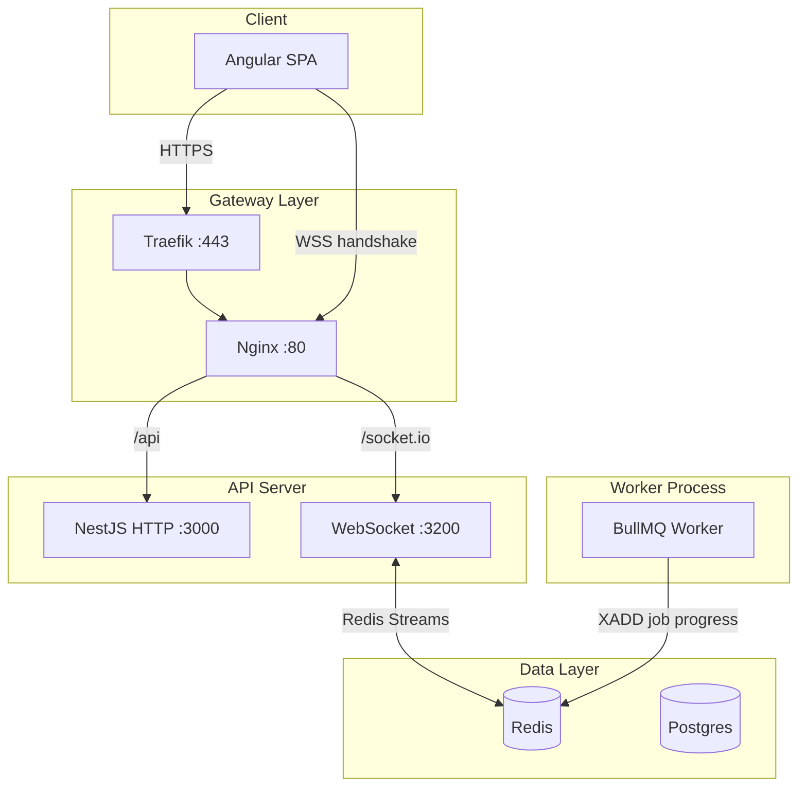

# WebSocket Architecture — Real-time Job Progress

WebSocket server for real-time document job progress (OCR, parsing, chunking, embeddings). Replaces aggressive REST polling with push-based updates.

## Architecture

## Data Flow

1. **Worker** updates `DocumentJob` in Postgres and publishes to Redis Stream `job:progress` via `JobProgressPublisher.publish()`.
2. **API** `JobProgressStreamConsumer` runs XREADGROUP on the stream; on each message, calls `WebSocketService.emitJobProgress()`.
3. **Socket.IO** emits `job:progress` to room `document:${workspaceId}:${documentId}`.
4. **Client** subscribes via `socket.emit('subscribe', { workspaceId, documentId })` and receives `job:progress` events.

## Constants (Single Source of Truth)

All WebSocket/Redis naming lives in `packages/shared/src/constants/websocket.ts`:

| Constant | Value | Used by |
|----------|-------|---------|
| `JOB_PROGRESS_EVENT` | `job:progress` | Redis stream name, Socket.IO event name |
| `JOB_PROGRESS_CONSUMER_GROUP` | `ws-consumers` | Redis consumer group |
| `documentRoom(workspaceId, documentId)` | `document:{ws}:{doc}` | Room names |

Publisher, consumer, gateway, and frontend import these from `@contractai-review/shared` to ensure consistency.

## Redis Streams

| Item | Value |
|------|-------|
| Stream name | `job:progress` (via `JOB_PROGRESS_EVENT`) |
| Consumer group | `ws-consumers` (via `JOB_PROGRESS_CONSUMER_GROUP`) |
| Commands | XADD (worker), XREADGROUP (API), XACK (API) |
| Retention | MAXLEN ~ 10000 (configurable) |

**Flow**: Worker XADDs entries with fields `documentId`, `workspaceId`, `payload` (JSON `DocumentJob`). API creates consumer group on startup, runs blocking XREADGROUP, processes messages, emits to Socket.IO, then XACKs.

## Auth and RBAC

- **Handshake**: Client sends JWT in `auth: { token: '...' }`. Server validates before accepting connection.
- **Subscribe**: Before joining room, server verifies workspace membership via `WorkspaceService.verifyMembership()` and document exists via `DocumentsService.findById()`.

## Event Contract

| Event | Direction | Payload |
|-------|------------|---------|
| `subscribe` | Client → Server | `{ workspaceId, documentId }` |
| `unsubscribe` | Client → Server | `{ workspaceId, documentId }` |
| `job:progress` | Server → Client | `{ documentId, workspaceId, job: DocumentJob }` |

## Room Naming

Rooms use `document:${workspaceId}:${documentId}` so only clients viewing that document receive updates.

## Environment Variables

| Variable | Default | Description |
|----------|---------|-------------|
| `WS_PORT` | `3200` | Port for WebSocket server |
| `WS_ENABLED` | `true` | Set to `false` to disable stream consumer |
| `JOB_PROGRESS_STREAM_MAXLEN` | `10000` | Redis Stream max length (via publisher) |
| `REDIS_URL` | — | Required for both BullMQ and WebSocket adapter/streams |

## Scaling

- **Socket.IO Redis adapter**: Multiple API replicas share rooms via Redis pub/sub; when one emits to a room, all emit to their connected clients.
- **Stream consumer group**: Each API instance runs a consumer; messages are distributed round-robin. The instance that receives a message emits via Socket.IO; the Redis adapter broadcasts to other instances.

## Infrastructure

- **Port 3200**: WebSocket server listens on `WS_PORT` (default 3200); REST remains on 3000.
- **Nginx**: `/socket.io` location proxies to `api_ws` upstream (api:3200) with upgrade headers.
- **Docker**: Api service has `WS_PORT: 3200` in env.

## Troubleshooting

| Issue | Check |
|-------|-------|
| Connection refused | API listening on 3200? Nginx proxying `/socket.io`? CORS for WS origin? |
| Auth failures | JWT valid? Token sent in `auth.token`? |
| No events | Worker publishing? Stream consumer running? Check `XPENDING` for stuck messages |
| Stuck messages | Run `XCLAIM` or inspect consumer group; ensure worker and API share same Redis |
