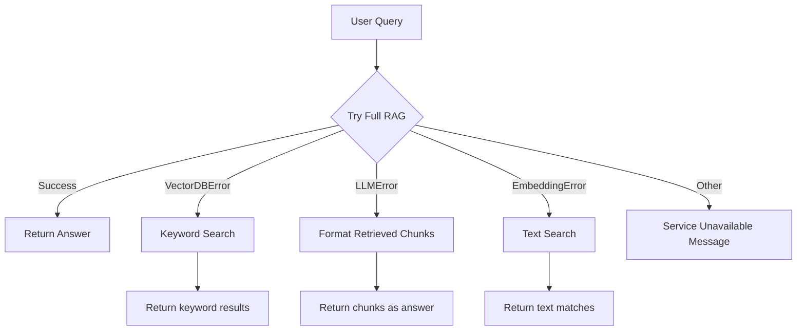

# RAG Pipeline Gap Analysis and Recommendations

## 1. Where is the RAG Pipeline?

**Location**: The RAG pipeline is split across these files:

| Component          | File                                                                                                    | Role                                                                          |
| ------------------ | ------------------------------------------------------------------------------------------------------- | ----------------------------------------------------------------------------- |
| Main RAG flow      | `[apps/api/src/rag/rag.service.ts](apps/api/src/rag/rag.service.ts)`                                    | `generateAnswer()`: embed question, search chunks, build context, call OpenAI |
| Contract retrieval | Same file                                                                                               | `searchContractChunks()` - pgvector cosine similarity                         |
| Legal retrieval    | Same file                                                                                               | `searchLegalChunks()` - pgvector + jurisdiction filter                        |
| Embeddings         | `[apps/api/src/rag/embeddings.service.ts](apps/api/src/rag/embeddings.service.ts)`                      | OpenAI `text-embedding-3-small`                                               |
| Chunking           | `[apps/api/src/rag/chunking.service.ts](apps/api/src/rag/chunking.service.ts)`                          | Paragraph/sentence/fixed-size strategies                                      |
| Ingestion flow     | Workers: `parsing.processor.ts`, `ocr.processor.ts`, `chunking.processor.ts`, `embeddings.processor.ts` | Parsing -> OCR (if scanned) -> Chunking -> Embeddings                         |
| Redline RAG        | `[apps/api/src/documents/redline.service.ts](apps/api/src/documents/redline.service.ts)`                | Similar flow for redline generation                                           |

Flow: `ChatController` -> `RagService.generateAnswer()` -> `EmbeddingsService` + pgvector search + `generateAnswerText()` (OpenAI).

---

## 2. Prompt Engineering Section

**Current state**: No dedicated prompt engineering layer. Prompts are hardcoded inline:

- `[rag.service.ts:284-293](apps/api/src/rag/rag.service.ts)` - Chat prompt
- `[redline.service.ts:112-155](apps/api/src/documents/redline.service.ts)` - Redline prompt + playbook variations

**Gap**: Prompts live inside business logic; no central registry, no A/B testing, no versioning, no easy iteration for legal-domain tuning.

**Recommendation**: Create a `PromptService` or `prompts/` module with:

- System prompts per use case (chat, redline, jurisdiction)
- Template variables (language, playbook, context)
- Optional: store prompts in DB for runtime tuning

---

## 3. Cache Strategy for Similar Queries

**Current state**: None. Every query runs the full pipeline:

- Embedding generation
- Vector search (contract + legal)
- LLM call

Redis is used only for BullMQ job queues, not for response caching.

**Recommendation**: Add semantic query cache:

- **Key**: hash of `(documentId, jurisdiction, normalizedQuery)` or embedding similarity
- **Value**: Cached `RagResponse`
- **Storage**: Redis (already in stack)
- **Similarity check**: Before full RAG, check cached queries; if embedding similarity > threshold (e.g., 0.95), return cached response
- **TTL**: Configurable (e.g., 24h for chat answers)
- **Invalidation**: When document is updated/reprocessed

---

## 4. Monitoring: Chunking, Embeddings, Retrieval

**Current state**: Minimal monitoring. `DocumentJob` tracks per-document progress (status, progress %, attempts, lastError) but no aggregated metrics for:

- Chunking efficiency (chunk count, avg size, overlap)
- Embedding performance (latency, failure rate, batch size)
- Retrieval quality (top-k similarity distribution, recall)

**Recommendations**:

1. **Application metrics** (Prometheus/OpenTelemetry):
  - `rag_embedding_latency_seconds`
  - `rag_retrieval_topk_similarity` (histogram)
  - `rag_chunk_count_per_document`
  - `rag_llm_latency_seconds`
2. **Retrieval quality**:
  - Log (without PII) top-k distances per query for analysis
  - Optional: human feedback loop (thumbs up/down) for recall calibration
3. **Dashboards**: Grafana with panels for latency percentiles, error rates, chunk distribution.
4. **Alerting**: High error rates, embedding/LLM latency spikes.

---

## 5. Policy Answer (Error-Based Fallbacks)

**Current state**: Limited. In `[rag.service.ts:228-251](apps/api/src/rag/rag.service.ts)`:

- Catches quota/429 and returns a friendly message
- All other errors return `Error generating answer: ${errorMessage}` as the answer text

**Gap**: No fallback chain like in your reference:

- VectorDB error → keyword search
- LLM error → return formatted chunks
- Embedding error → text search

**Recommendation**: Implement a policy-answer layer:

- Define custom error types: `VectorDBError`, `LLMError`, `EmbeddingError`
- Wrap pgvector calls, OpenAI embedding, and LLM calls
- Implement `keywordSearch()` (PostgreSQL `tsvector`/`pg_trgm` or simple ILIKE)
- Implement `formatRetrievedChunks()` (return top chunks as bullet points)
- Implement `textSearch()` (ILIKE on chunk text)
- Catch-all: generic "Service temporarily unavailable" (i18n)

---

## 6. Ingestion: Docling for PDF/DOCX to Markdown

**Current state**:

- **PDF**: `[pdf-parser.service.ts](apps/api/src/rag/pdf-parser.service.ts)` uses `pdf-parse` (basic text extraction). No markdown output.
- **DOCX**: Upload validator accepts DOCX, but parsing processor explicitly rejects it: only `application/pdf` and `text/plain` are handled (`[parsing.processor.ts:224-229](apps/api/src/workers/parsing.processor.ts)`).
- **Images (PNG/JPG)**: Go to OCR (Tesseract) for text extraction.

**Docling**: Not used. Docling is a Python library for document conversion (PDF, DOCX, etc.) to structured markdown with layout preservation.

**Recommendations**:

1. **Short term (Node.js)**: Add DOCX support with `mammoth` (extract text/HTML) or `docx` npm package. Simpler than Docling, no Python bridge.
2. **Docling integration** (if you want markdown + layout):
  - Docling is Python; you’d need a Python microservice or subprocess
  - Call Docling from a worker, store markdown in storage, feed to chunking
  - Better layout/structure for complex contracts (tables, sections)

---

## 7. Hybrid Recall (Semantic + Keyword)

**Current state**: Only semantic (vector) search via pgvector. No keyword/text search.

**Recommendation**: Implement hybrid recall:

1. **Keyword search** in PostgreSQL:
  - Add `tsvector` column on `chunks.text` and use `ts_rank` / `plainto_tsquery`
  - Or `pg_trgm` for trigram similarity (e.g., `similarity(text, query)`)
2. **Hybrid fusion**:
  - Run semantic and keyword search in parallel
  - Fuse with Reciprocal Rank Fusion (RRF) or weighted score
  - Example: `score = 0.7 * semantic_score + 0.3 * keyword_score`
3. **Fallback**: If vector search fails (VectorDBError), use keyword-only as in the policy-answer flow.

---

## 8. vLLM vs Llama.cpp (Local LLM)

**Current state**: OpenAI API only (`openai` package) for both embeddings and chat.

**vLLM**:

- High-throughput Python server for OpenAI-compatible inference
- Good for batch inference, multiple concurrent requests
- Use case: self-hosted inference, cost control, data locality

**Llama.cpp**:

- C++ inference, very fast on CPU/Apple Silicon
- Lighter than vLLM, good for single-node/edge
- Often used via `llama-cpp-python` or Node bindings

**Recommendations**:

- **If staying cloud**: Keep OpenAI; add caching and policy answers to reduce cost and improve resilience.
- **If going local**:
  - **Embeddings**: Consider `sentence-transformers` via Python API or local embedding models (e.g., `all-MiniLM-L6-v2`) if you add a Python worker.
  - **LLM**: vLLM if you need high throughput and OpenAI-compatible API; Llama.cpp if you prefer minimal footprint and CPU-only.
- **Integration**: Abstract behind an `LLMProvider` interface (OpenAI, vLLM, Llama.cpp) so you can switch via config.

---

## Summary Table

| #   | Topic              | Current                        | Gap                                 |
| --- | ------------------ | ------------------------------ | ----------------------------------- |
| 1   | RAG pipeline       | `RagService` + workers         | Centralized, works                  |
| 2   | Prompt engineering | Inline prompts                 | No dedicated layer                  |
| 3   | Cache              | None                           | No similar-query cache              |
| 4   | Monitoring         | Job progress only              | No chunk/embed/retrieval metrics    |
| 5   | Policy answer      | Quota + generic error          | No VectorDB/LLM/Embedding fallbacks |
| 6   | Docling            | Not used; pdf-parse, Tesseract | No Docling; DOCX not parsed         |
| 7   | Hybrid recall      | Vector only                    | No keyword search                   |
| 8   | vLLM/Llama.cpp     | OpenAI only                    | No local LLM                        |

---

## Suggested Implementation Order

1. **Policy answer** – Improves resilience with minimal dependencies
2. **Cache** – Uses existing Redis; big impact on latency and cost
3. **DOCX support** – Validator allows it but parser rejects it
4. **Hybrid recall** – Improves retrieval quality
5. **Prompt service** – Cleaner iteration
6. **Monitoring** – Metrics and dashboards
7. **Docling** – If markdown structure is important
8. **Local LLM** – Only if self-hosting is required

